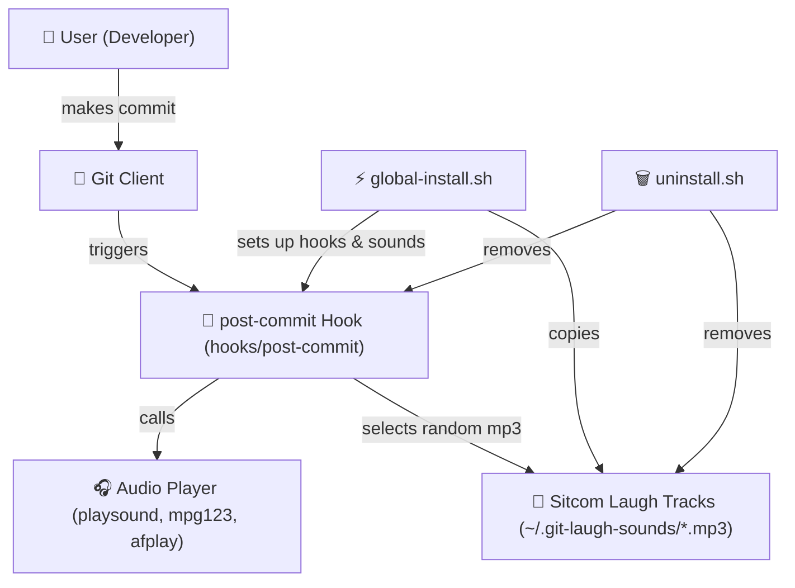

# 📢 Git Laugh Track 🎶


[](LICENSE)
[](https://github.com/eleven-dev-cafe/.github/blob/main/CONTRIBUTING.md)
[](https://www.python.org/)

***Play funny sound effects on every **Git commit** or **push**.***  
***Turn boring commits into a party 🎉***

</br>

## ✨ Features
- 🔊 Play a random `.mp3` from your sound library on **commit** and **push**  
- ⚡ Works across **Linux, macOS, Windows (via WSL/terminal)**  
- 🎛 CLI commands to **play**, **add**, and **list** sounds  
- 🔗 Easy setup via global Git hooks

</br>

## 🗺️ Architecture



</br>

## 🎥 Demo Video(Enable Sound 🔊) 
https://github.com/user-attachments/assets/794d3f7e-eace-496e-8534-2134725aa4d6  

</br>

## 📦 Installation

Clone the repo and install it locally:

```bash
git clone https://github.com/eleven-dev-cafe/git-laugh-track.git
cd git-laugh-track
pip install .
```
This installs the CLI command git-laugh.

</br>

### 🎮 Usage

**Once installed, you can use the CLI tool:**

Setup Git hooks and sounds for laugh sounds
```bash
git-laugh install       
```

Remove Git hooks and Sounds
```bash
git-laugh uninstall
```

Play a random laugh sound on each commit..
```bash
git-laugh play 
```

### Git workflow
- Run `git commit -m "fix bug"` → plays a random sound 🎶
- Run `git push` → plays another random sound 


</br>

### 🔊 Adding Sounds

Place `.mp3` files into your sound directory:
- Default: `~/.git-laugh-sounds/`
Or add via CLI:
```bash
git-laugh add funny.mp3
```
> Reinstall `git-laugh` to copy sounds at defaults

</br>

## 🛠 Development

Install dev dependencies:
```bash
pip install -r requirements.txt
```

Run tests:
```bash
pytest
```

</br>
## 📜 License

This project is licensed under the `BSD 3-Clause` License – see the [LICENSE](LICENSE) file for details.

</br>

## 👨‍💻 Developer  
`Gyarsilal Solanki`

[](https://www.linkedin.com/in/gyarsilal-solanki)  🤝  [](https://github.com/gyarsilalsolanki011)

  
Join us to discuss ideas, share feedback, and coordinate contributions:  
[](https://discord.gg/Zrc9x3ts)

</br>

## 💡 Inspiration

**Because coding is serious business… but your commits don’t have to be 🤣**</br>
***If you find this project helpful, consider giving it a ⭐ to support!***
