# 📢 Git Laugh Track 🎶


[](LICENSE)
[](https://github.com/eleven-dev-cafe/.github/blob/main/CONTRIBUTING.md)
[](https://www.python.org/)

***Play funny sound effects on every **Git commit**.***  
***Turn boring commits into a party 🎉***

<br>

## 🗺️ Architecture

```mermaid
flowchart TD
    User["👤 User (Developer)"]
    Git["🐙 Git Client"]
    PostCommitHook["🔗 post-commit Hook (hooks/post-commit)"]
    SoundFiles["🎵 Sitcom Laugh Tracks (~/.git-laugh-sounds/*.mp3)"]
    AudioPlayer["🎧 Audio Player (playsound, mpg123, afplay)"]
    Installer["⚡ global-install.sh"]
    Uninstaller["🗑️ uninstall.sh"]

    User --makes commit--> Git
    Git --triggers--> PostCommitHook
    PostCommitHook --selects random mp3--> SoundFiles
    PostCommitHook --calls--> AudioPlayer
    Installer --sets up hooks & sounds--> PostCommitHook
    Installer --copies--> SoundFiles
    Uninstaller --removes--> PostCommitHook
    Uninstaller --removes--> SoundFiles
```



<br>

## 🎥 Demo Video(Enable Sound 🔊) 
https://github.com/user-attachments/assets/794d3f7e-eace-496e-8534-2134725aa4d6  

<br>

## ✨ Features
- 🔊 Play a random `.mp3` from your sound library on  git **commit**  
- ⚡ Works across **Linux, macOS, Windows (via WSL/terminal)**  
- 🎛 CLI commands to **play**, **add**, and **list** sounds  
- 🔗 Easy setup via global Git hooks  

</br>


## 📦 Installation

**Clone the repo and install it locally:**  
1. Clone the repository
```bash
git clone https://github.com/eleven-dev-cafe/git-laugh-track.git
cd git-laugh-track
```
2. Install dev dependencies:
```bash
pip install -r requirements.txt
```

3. Install the CLI command `git-laugh`
```bash
pip install .
```

Uninstall the CLI command `git-laugh`
```bash
pip uninstall git-laugh-track
```

<br>

### 🔊 Adding Sounds

Place `.mp3` files into your `/sounds` directory
- Default: `~/.git-laugh-sounds/`

Or add via CLI:
```bash
git-laugh add <path-to-sound>
```

<br>

### 🎮 Usage

**Once installed, you can use the CLI tool:**

Setup Git hooks and sounds for laugh sounds
```bash
git-laugh install       
```

Remove Git hooks and Sounds
```bash
git-laugh uninstall
```

Play a random laugh sound on each commit..
```bash
git-laugh play 
```

### Git workflow
- Run `git commit -m "fix bug"` → plays a random sound 🎶
- Run `git push` → plays another random sound(soon...) 

<br>

## 📜 License

This project is licensed under the [`BSD 3-Clause`](LICENSE) License.

<br>

## 👨‍💻 Developer  
**`Gyarsilal Solanki`**

[](https://www.linkedin.com/in/gyarsilal-solanki)  🤠 [](https://github.com/gyarsilalsolanki011)

  
**`Need Help!`**  in installation, Join us: 

[](https://github.com/eleven-dev-cafe/cafe-talks/discussions)   
[](https://chat.whatsapp.com/Fzt4KispCmk0seaPgSvkyX)  
[](https://discord.gg/Zrc9x3ts)  
***You can also discuss your ideas, share feedbacks, and coordinate contributions.*** 
 
<br>

## 💡 Inspiration

**Because coding is serious business… but your commits don’t have to be 🤣**</br>
***If you find this project helpful, consider giving it a ⭐ to support!***
